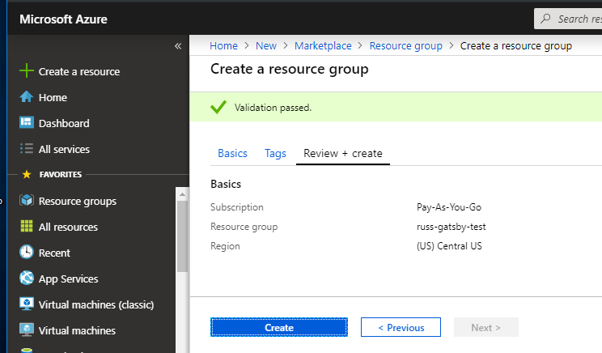
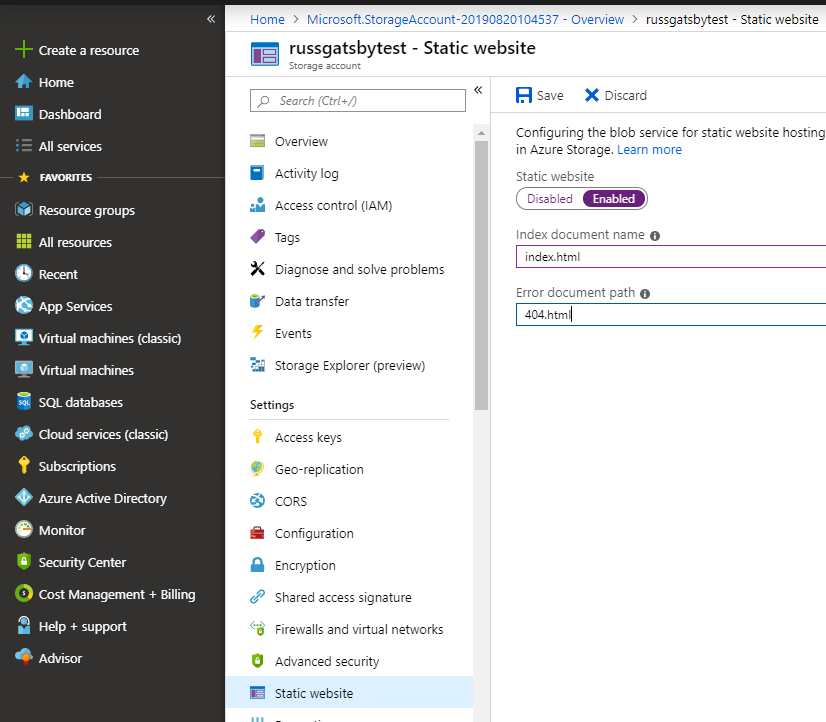
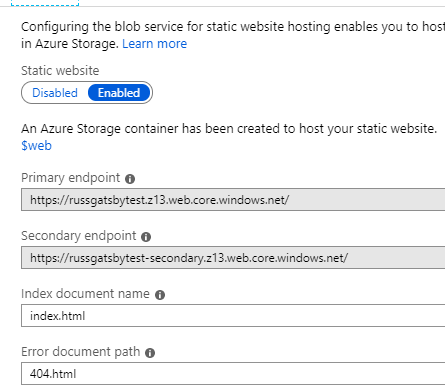
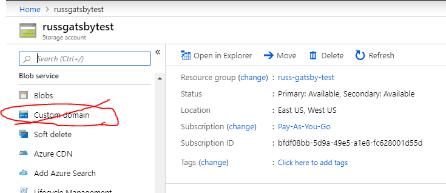
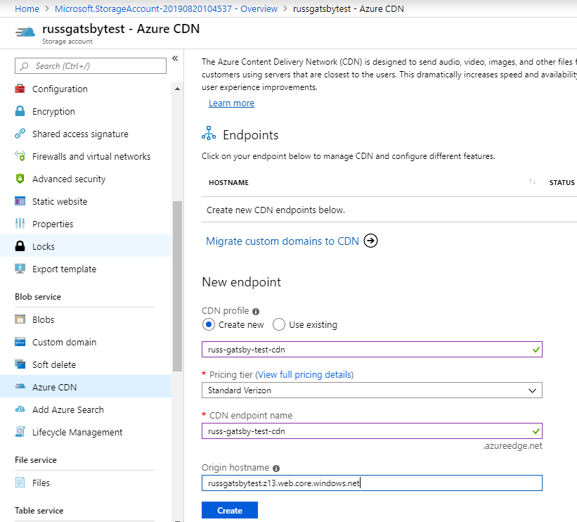
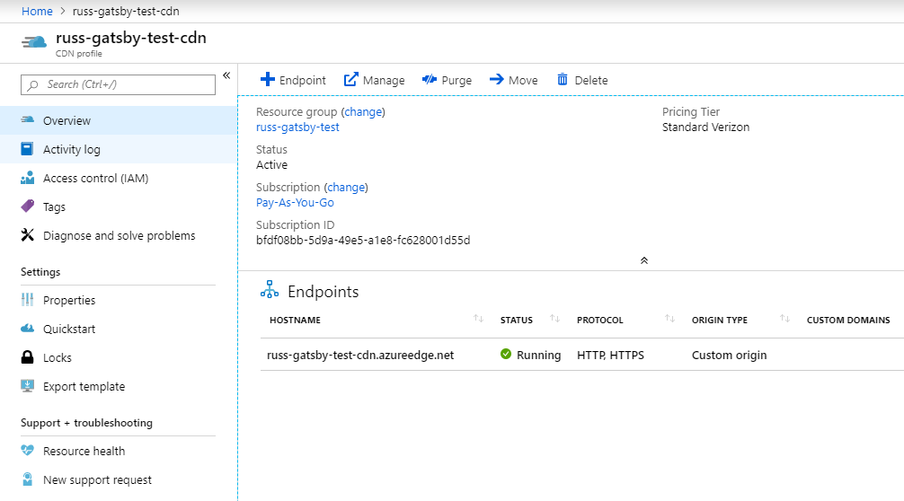

### Why host Gatsby on Azure

- Azure's portal, IMO, is much easier to navigate than AWS. Both are both equally reliable and robust though.
- Hosting static content on Azure is ***CHEAP***, and if you have a new account it's actually free for the first year.

### Steps For Setup

1. Make sure you have a resource group setup, which is just a general bucket for basically everything you create in Azure. 
2. Then you will need to create a storage account.
3. Once inside of the storage account go to the sidebar and select *Configure Static Website*.
4. After saving the static website it should look something like this:
5. Deploy your website to the new **$web** container that was created for your site. You can do this through the portal but it's much easier to use the VSCODE/VisualStudio plugins so you can deploy it whenever you would like without logging in to the portal.
6. Make sure you website is up and working from the *Primary endpoint* in step #4.
7. Although it seems tempting but using the *Custom domain* option in the storage account, this *DOES NOT* support HTTPS so skip this.  Azure Storage does not currently support HTTPS with custom domains. It's 2019, every site should be through HTTPS, including yours. 
8. To get your Gatsby site setup on your custom domain through HTTPS we are going to set up a CDN. This currently *HAS* to be done because Azure Storage does not currently support HTTPS with custom domains. This is unfortunate, BUT CDNs will cache our data so it will only further help with our website speed. **The orgin hostname should be the same as the *primary endpoint* from step #4.**
9. Once the CDN and endpoint is created you can see your endpoint name and url as previously specified.
10. Go to the registrar for you custom domain and setup a new CNAME record through their DNS management.  Add a new mapping for your new CDN endpoint to your custom domain. An example from NameHost: INSERT PHOTO HERE OF A NEW CNAME MAPPING
11. While you are in there, if you do not have email setup for your domain you should either do that now or setup a global rule for forwarding all incoming emails. You can delete this rule later but it is needed for the next step.
12. Now there has be verification that you own the domain.  Apparently this sometimes *just works without intervening* but for myself I had to manually prove it was mine through an email. What happens is Azure(through DigiCert) sends an email to the following emails:
    - **admin** *@yourdomain.com*
    - **admin** *@yourdomain.com*
    - **admin** *@yourdomain.com*
    - **admin** *@yourdomain.com*
    - **admin** *@yourdomain.com*
Without setting up the email forwarding rule in step#11 these emails never arrive and you cannot validate your domain.
13. Once the domain is validated your custom domain should now direct traffic to your CDN endpoint through HTTPS.
