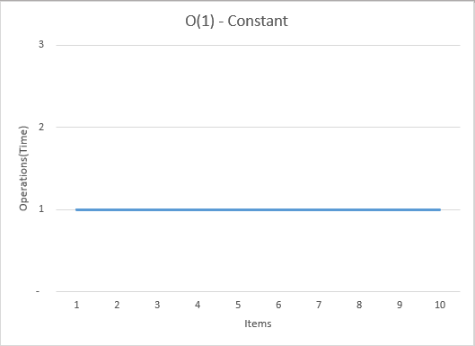
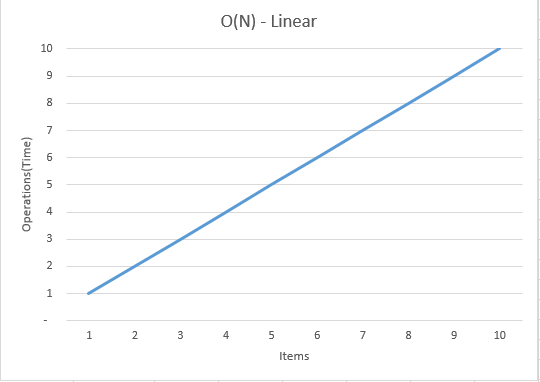
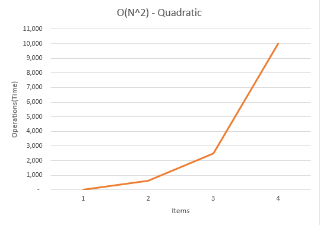
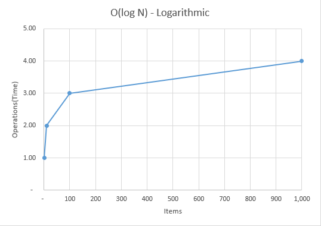

> Accompanying YouTube Video: [https://youtube.com/asdfasdfa](https://youtube.com/asdfasdfa)

## Notes
- Big O Notation tries to explain how many operations, or how long it will take something to execute and how that changes with differeing input sizes.
- It allows us to compare and classify algorythms in terms how long they take to complete.
- Multiple ways to solve the same problem, most of the examples will be in arrays or some other type of collection since that's a very common use case.
- Also it shows us how quickly this these operations grows.
- Usually here we are just worried about the worst case scenario. So if we are trying to find a value in our array, it MIGHT be in the first index, but it COULD be in the last and we have to iterate through every item to find it.
- "N" is the size of the input.
- [Examples.xlsx](./Examples.xlsx)

---

### O(1) : Constant Time
- Number of operations is the same regardless of the size of the input.
- Code Source: [O1-Constant.js](O1-Constant.js)
```javascript
const arr1 = [1, 2, 3, 4, 5];
const arr2 = [1, 2, 3, 4, 5, 6, 7, 8, 9, 10];
const arr1Value = arr1[3];
const arr2Value = arr2[7];
```


---

### O(N) : Linear Time
- Number of operations is proportional to the size of the input.
- Code Source: [ON-Linear.js](ON-Linear.js)
```javascript
const arr1 = [1, 2, 3, 4, 5];
const arr2 = [1, 2, 3, 4, 5, 6, 7, 8, 9, 10];
let totalArr1 = 0;
for (let i = 0; i < arr1.length; i++) {
    totalArr1 += arr1[i];
}
let totalArr2 = 0;
for (let i = 0; i < arr2.length; i++) {
    totalArr2 += arr2[i];
}
```


---

### O(N^2) : Quadratic Time
- Number of operations is the square of the number of inputs.
- Code Source: [ON2-Quadratic.js](ON2-Quadratic.js)
```javascript
const arr1 = [1, 2, 3, 4, 5];
const arr2 = [1, 2, 3, 4, 5, 6, 7, 8, 9, 10];
for (let i = 0; i < arr1.length; i++) {
    var outerItem = arr1[i];
    for (let j = 0; j < arr2.length; j++) {
        var innerItem = arr2[j];
        let someSum = outerItem + innerItem;
    }
}
```


---

### O(log N) Logarithmic 
- Number of operations peaks at the beginning and then flattens as the size of the input increases.
- Binary Search Tree
- Code Source: [OlogN-Logarithmic.js](OlogN-Logarithmic.js)
- Original Source: [https://gist.github.com/alexhawkins/f993569424789f3be5db](https://gist.github.com/alexhawkins/f993569424789f3be5db)
```javascript
class BinarySearchTree {
    constructor() {
        this.root = null;
    }
    makeNode(value) {
        var node = {};
        node.value = value;
        node.left = null;
        node.right = null;
        return node;
    }
    add(value) {
        var currentNode = this.makeNode(value);
        if (!this.root) {
            this.root = currentNode;
        }
        else {
            this.insert(currentNode);
        }
        return this;
    }
    insert(currentNode) {
        var value = currentNode.value;
        var traverse = function (node) {
            if (value > node.value) {
                if (!node.right) {
                    node.right = currentNode;
                    return;
                }
                else
                    traverse(node.right);
            }
            else if (value < node.value) {
                if (!node.left) {
                    node.left = currentNode;
                    return;
                }
                else
                    traverse(node.left);
            }
        };
        traverse(this.root);
    }
    remove(node) {
    }
    contains(value) {
        var node = this.root;
        var traverse = function (node) {
            if (!node)
                return false;
            if (value === node.value) {
                return true;
            }
            else if (value > node.value) {
                return traverse(node.right);
            }
            else if (value < node.value) {
                return traverse(node.left);
            }
        };
        return traverse(node);
    }
}
var bst1 = new BinarySearchTree();
bst1.add(40).add(25).add(78).add(10).add(32);
console.log('bst1', bst1);
var bst2 = new BinarySearchTree();
bst2.add(10).add(20).add(30).add(5).add(8).add(3).add(9);
console.log('bst2', bst2);
```

  
---